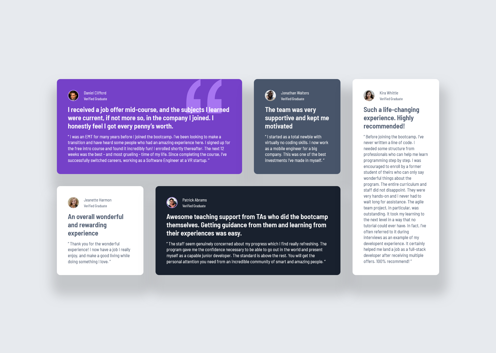

# Frontend Mentor - Testimonials grid section solution

This is a solution to the [Testimonials grid section challenge on Frontend Mentor](https://www.frontendmentor.io/challenges/testimonials-grid-section-Nnw6J7Un7). Frontend Mentor challenges help you improve your coding skills by building realistic projects. 

## Table of contents

- [Overview](#overview)
  - [Screenshot](#screenshot)
  - [Links](#links)
- [My process](#my-process)
  - [Built with](#built-with)
  - [What I learned](#what-i-learned)
  - [Continued development](#continued-development)
  - [Useful resources](#useful-resources)
- [Author](#author)
- [Acknowledgments](#acknowledgments)

## Overview

### Screenshot




### Links

- Solution URL: [Solution here](https://github.com/MariaCMontO/testimonials-cmo)

## My process

### Built with

- Semantic HTML5 markup
- CSS custom properties
- Grid

### What I learned

With this project, I learned how to use grid (how to divide the layout regarding of the context), and how to make responsive projects ussing clamp, which was so usefull to avoid using media queries. I also learned how to use box-shadows on elements to make it look better.
Other important thing I learned in this project is how to locate a decorative image behing a text.

```css
.card {
    border-radius: 1rem;
    padding: 3.2rem;
    display: flex;
    flex-direction: column;
    gap: 1rem;
    text-align: start;
    box-shadow: 0.5rem 4rem 3rem 2rem rgba(0, 0, 0, 0.15);
    position: relative;
}
.card .quotation {
    display: none;
    max-inline-size: 10.2rem;
    position: absolute;
    inset-inline-end: 6rem;
    inset-block-start: 0;
    z-index: 0;
}
.card *:not(.quotation) {
    position: relative;
    z-index: 1;
}
@media (min-width:76.8rem) {
    .container {
        display: grid;
        grid-template-columns: repeat(4, 1fr);
        gap: 3.5rem;
    }

    .daniel {
        grid-column: 1/3;
    }

    .jonathan {
        grid-column: 3/4;
    }

    .kira {
        grid-column: 4/5;
        grid-row: 1/3;
    }

    .jeanette {
        grid-column: 1/2;
    }

    .patrick {
        grid-column: 2/4;
    }

    .card .quotation {
        display: block;
    }
}
```

### Continued development

I definitely want to keep developing interfaces using the rem unit - it makes many task much easier. I also want to keep using tools like clamp() and min() in order to make responsive layouts easier.

### Useful resources

## Author

- Frontend Mentor - [@MariaCMontO](https://github.com/MariaCMontO)


## Acknowledgments